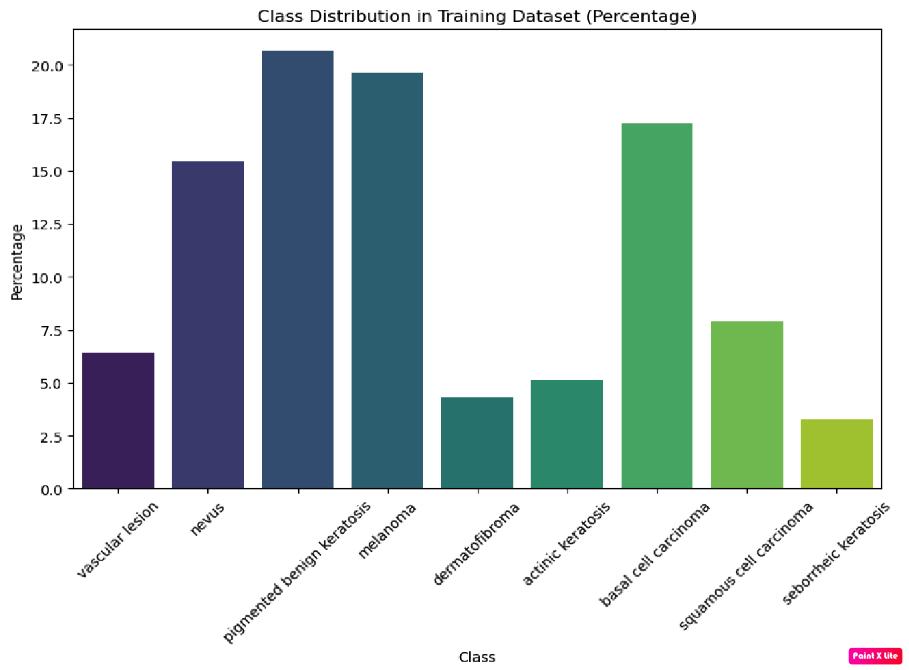
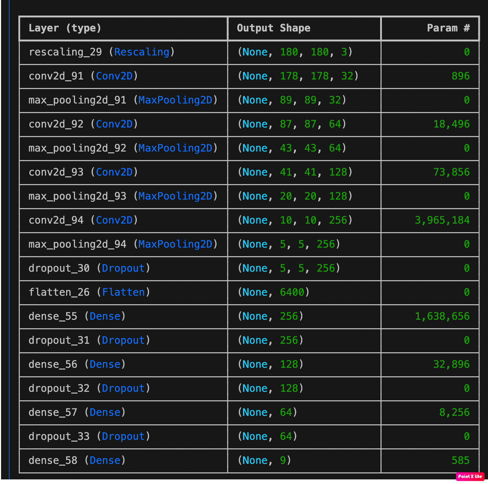
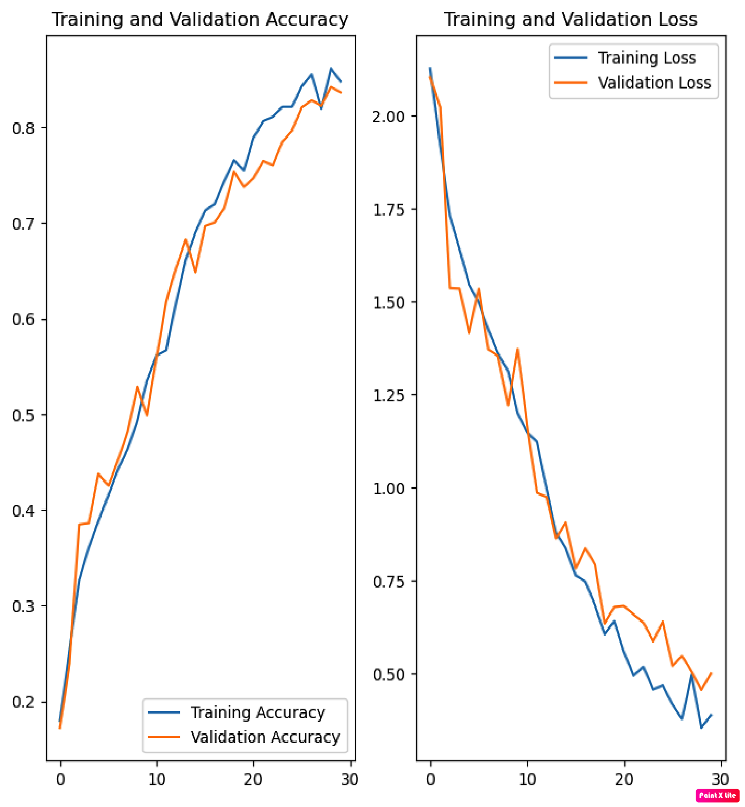

# Melanoma Detection using CNN
Problem statement: Problem statement: To build a CNN based model which can accurately detect melanoma. Melanoma is a type of cancer that can be deadly if not detected early. It accounts for 75% of skin cancer deaths. A solution that can evaluate images and alert dermatologists about the presence of melanoma has the potential to reduce a lot of manual effort needed in diagnosis.

## Overview
This project aims to build a Convolutional Neural Network (CNN) based model to accurately detect melanoma, a type of skin cancer. Melanoma accounts for 75% of skin cancer deaths and can be deadly if not detected early. A solution that can evaluate images and alert dermatologists about the presence of melanoma has the potential to reduce a lot of manual effort needed in diagnosis.

## Dataset
The dataset used for this project consists of images of skin lesions. The dataset is divided into training and validation sets with a 80-20 split.

## Data Augmentation
To improve the robustness of the model, data augmentation techniques are applied to the training dataset. The following augmentations are used:
- Rescaling
- Rotation
- Width Shift
- Height Shift
- Shear
- Zoom
- Horizontal Flip
  
Data Percentage : 

## Model Architecture
The CNN model consists of the following layers:
- Convolutional layers with ReLU activation
- MaxPooling layers
- Flatten layer
- Dense layers with ReLU activation
- Dropout layer for regularization
- Output layer with softmax activation

## Training
The model is trained using the Adam optimizer and sparse categorical cross-entropy loss. Early stopping and learning rate reduction on plateau are used as callbacks to improve training efficiency.

Final Model Summary: 


## Usage
1. Clone the repository:
    ```bash
    git clone https://github.com/yourusername/melanoma-detection.git
    cd melanoma-detection
    ```

2. Install the required dependencies:
    ```bash
    pip install -r requirements.txt
    ```

3. Prepare the dataset:
    - Place your training images in the `data/train` directory.
    - Place your validation images in the `data/validation` directory.

4. Run the training script:
    ```bash
    python train.py
    ```

Note:-
Download dataset from https://drive.google.com/file/d/1xLfSQUGDl8ezNNbUkpuHOYvSpTyxVhCs/view?usp=sharing 
create data folder and extract the downloaded zip file and keep two folders as data/Train and data/Test

## Results
The model achieves an accuracy of approximately 85% on the training set and 83% on the validation set. 
The final model showcases well-balanced performance, displaying no signs of underfitting or overfitting.
The implementation of class rebalancing has enhanced the model's performance in both training and validation datasets.
In total 30 epochs, the final model attains an accuracy of 85% on the training set and 83% on the validation set.
The addition of batch normalization failed to enhance both training and validation accuracy.

Final Accracy : 

## Future Work
- Experiment with different model architectures and hyperparameters.
- Use transfer learning with pretrained models like VGG16, ResNet50, or InceptionV3.
- Collect more data to improve model performance.

## Contributing
Contributions are welcome! Please open an issue or submit a pull request for any improvements or bug fixes.

## License
This project is licensed under the MIT License. See the [LICENSE](LICENSE) file for details.

## Acknowledgements
- The dataset used in this project is provided by [source].
- The project is inspired by the need to assist dermatologists in early detection of melanoma.
